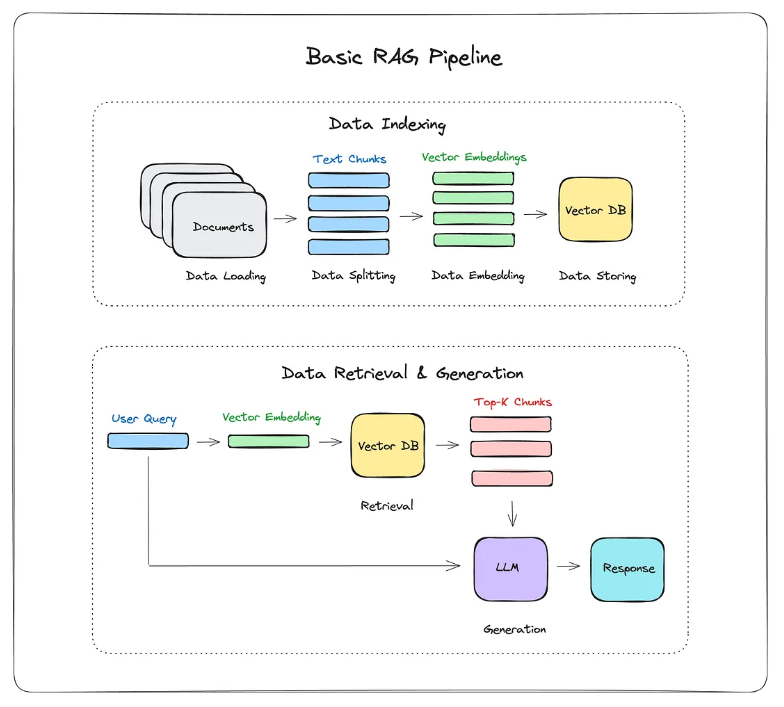

# Stack Overflow Semantic Search + RAG (Endee)

A complete end-to-end project that builds a semantic search and retrieval-augmented generation (RAG) assistant using:

- **Vector database:** Endee (https://github.com/endee-io/endee)
- **Embeddings:** sentence-transformers (`all-MiniLM-L6-v2`)
- **UI:** Streamlit
- **Dataset:** Stack Overflow questions (CSV)
- **LLM:** Azure OpenAI GPT-4.1

---

## 🖼️ Basic RAG Pipeline (Visual)

Below is a screenshot illustrating the core Retrieval-Augmented Generation (RAG) pipeline used in this project:



> The pipeline shows how a user query is processed: relevant documents are retrieved from Endee vector DB, and Azure OpenAI GPT-4.1 generates a context-aware answer using those documents.

---

## 📦 Prerequisites

- Python 3.8+
- Docker (for running Endee server)
- Azure OpenAI access (for GPT-4.1)

---

## 🚀 Setup

### 1. **Install dependencies**

```bash
pip install -r requirements.txt
```

### 2. **Install Docker (if not already installed)**

- [Download Docker Desktop](https://www.docker.com/products/docker-desktop/) and follow the installation instructions for your OS.
- After installation, verify Docker is running:

```bash
docker --version
```

### 3. **Run Endee (Vector DB) with Docker**

You can run the Endee server locally using Docker:

```bash
docker pull endeeio/endee:latest
docker run -d -p 8080:8080 --name endee endeeio/endee:latest
```

By default, the code expects:

- `http://localhost:8080` as the API URL

If your server runs elsewhere, set:

```bash
export ENDEE_API_URL=http://<host>:<port>
export ENDEE_API_TOKEN=<token_if_needed>
```

### 4. **Prepare data**

Place your Stack Overflow CSV at `data/train/Questions.csv`.

Then sample it (creates `data/processed/sample.csv`):

```bash
python -m src.sample_data
```

### 5. **Generate embeddings (optional, for faster ingestion)**

```bash
python -m src.embed
```

### 6. **Ingest embeddings into Endee**

```bash
python -m src.ingest
```

### 7. **Configure Azure OpenAI**

Set the following environment variables with your Azure OpenAI details:

```bash
export AZURE_OPENAI_API_KEY=your-azure-openai-key
export AZURE_OPENAI_BASE_URL=https://<your-resource-name>.openai.azure.com/
export AZURE_OPENAI_DEPLOYMENT=your-deployment-name
```

> **Note:**
>
> - `AZURE_OPENAI_API_KEY`: Your Azure OpenAI API key
> - `AZURE_OPENAI_BASE_URL`: Your Azure OpenAI resource endpoint
> - `AZURE_OPENAI_DEPLOYMENT`: The deployment name you set up in Azure for GPT-4.1

### 8. **Run Streamlit UI**

```bash
streamlit run app.py
# If streamlit not found, try:
python -m streamlit run app.py
```

---

## 🛠️ Troubleshooting

- If you see errors about missing modules, run `pip install -r requirements.txt`.
- If Streamlit is not recognized, install it: `pip install streamlit`.
- If you see PyTorch errors, install the correct version: `pip install torch`.
- For sentence-transformers, ensure `torch` and `scikit-learn` are installed.
- If Endee index is missing, check server logs and index creation logic.
- For Azure OpenAI errors, check your API key, endpoint, and deployment name.

---

## 🧠 How it works

### 1) Sampling

`src/sample_data.py` loads the large CSV in chunks, drops incomplete rows, and uses reservoir sampling to keep memory usage low.

### 2) Embedding + Storage

`src/ingest.py` uses `sentence-transformers/all-MiniLM-L6-v2` to embed each question (title + body), then stores the vectors in Endee under the configured collection.

### 3) Retrieval

`src/retrieve.py` embeds the user query and uses Endee’s `query()` to fetch the most similar docs.

### 4) RAG (Retrieval-Augmented Generation)

`src/rag.py` builds a prompt from retrieved documents and calls Azure OpenAI GPT-4.1 (if your Azure credentials are set). Otherwise, it returns a simple fallback answer built from the retrieved snippets.

**RAG Explanation:**  
Retrieval-Augmented Generation (RAG) is a technique that combines information retrieval with generative AI. When a user asks a question, the system first retrieves relevant documents from a vector database (Endee), then feeds those documents as context to a large language model (Azure OpenAI GPT-4.1) to generate a more accurate and context-aware answer.

### 5) UI

`app.py` provides a simple Streamlit UI to enter queries, view top results, and see generated answers.

---

## 🧩 Configuration

Configuration values are in `src/config.py` and can be overridden with environment variables:

- `ENDEE_API_URL` – Endee API URL (default: `http://localhost:8080`)
- `ENDEE_API_TOKEN` – Endee token (if required)
- `EMBEDDING_MODEL` – Embedding model (default: `sentence-transformers/all-MiniLM-L6-v2`)
- `TOP_K` – Number of results to retrieve
- `AZURE_OPENAI_API_KEY` – Azure OpenAI API key for RAG
- `AZURE_OPENAI_BASE_URL` – Azure OpenAI resource endpoint
- `AZURE_OPENAI_DEPLOYMENT` – Azure OpenAI deployment name (for GPT-4.1)

---

## ✅ Example query

In the Streamlit app, try simple questions like:

- "How do I merge two pandas DataFrames?"
- "What is the difference between list and tuple in Python?"
- "How do I fix a null pointer exception in Java?"

---

## 📌 Where Endee is used

Endee is used as the vector store:

1. `src/ingest.py` creates an Endee index and upserts embeddings + metadata.
2. `src/retrieve.py` queries Endee with an embedding for semantic search.
3. `src/rag.py` uses the retrieved documents to build context for generation.

---

**You are now ready to run a full-stack RAG pipeline using Endee and Azure OpenAI GPT-4.1!**
